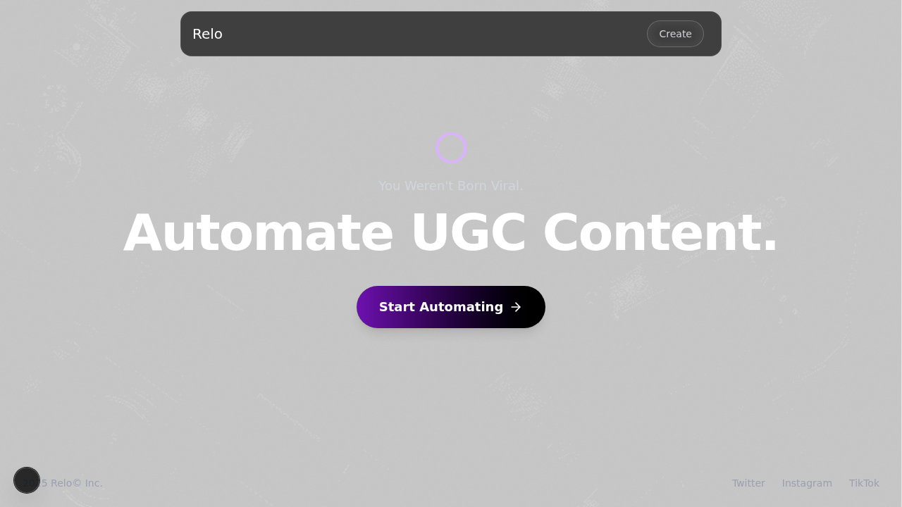

# Relo AI

Multi-agent platform for User Generated Content (UGC) creation.



## Demo

[Watch a demo of Relo AI in action](./public/delight.mp4)

## What It Does

Relo AI gives you two AI agents that work together to create viral-ready UGC content:

**Hook Agent** - Optimizes your hooks to be scroll-stopping and engaging.

**Script Agent** - Expands your hooks into a structured, retention-optimized script.

**Voice Over Generation** - Generates high-quality voice over for your scripts using ElevenLabs API.

## Quick Start

```bash
git clone <your-repo-url>
cd relo-ai
pnpm install
pnpm dev
```

Set up your `.env` file:
```
GOOGLE_API_KEY=your_key
ELEVENLABS_API_KEY=your_key
```

## Core Features

- **Multi-agent architecture:** Specialized agents for each step of the content creation process.
- **Interactive chat UI:** Chat with the agents to refine your ideas.
- **Workflow editor:** Visualize and manage the content creation workflow.
- **High-quality voice over:** Generate realistic voice over for your scripts.

## How It Works

The Hook Agent helps you craft catchy hooks for your videos. Once you have a hook, the Script Agent expands it into a full script. Finally, you can generate a voice over for your script using the integrated ElevenLabs API.

## Tech Stack

- **Next.js:** React framework for building the user interface.
- **TypeScript:** Typed superset of JavaScript.
- **Tailwind CSS:** Utility-first CSS framework.
- **@iqai/adk:** Agent Development Kit for building AI agents.
- **ElevenLabs:** API for generating high-quality voice over.
- **React Flow:** Library for building node-based editors.

## Use Cases

- Create scripts for TikTok, Instagram Reels, and YouTube Shorts.
- Generate voice over for your videos.
- Brainstorm ideas for new content.
- Learn how to write better hooks and scripts.

## Documentation

The platform is designed to be self-explanatory through the interactive chat interface. The agents will guide you through the process of creating content.